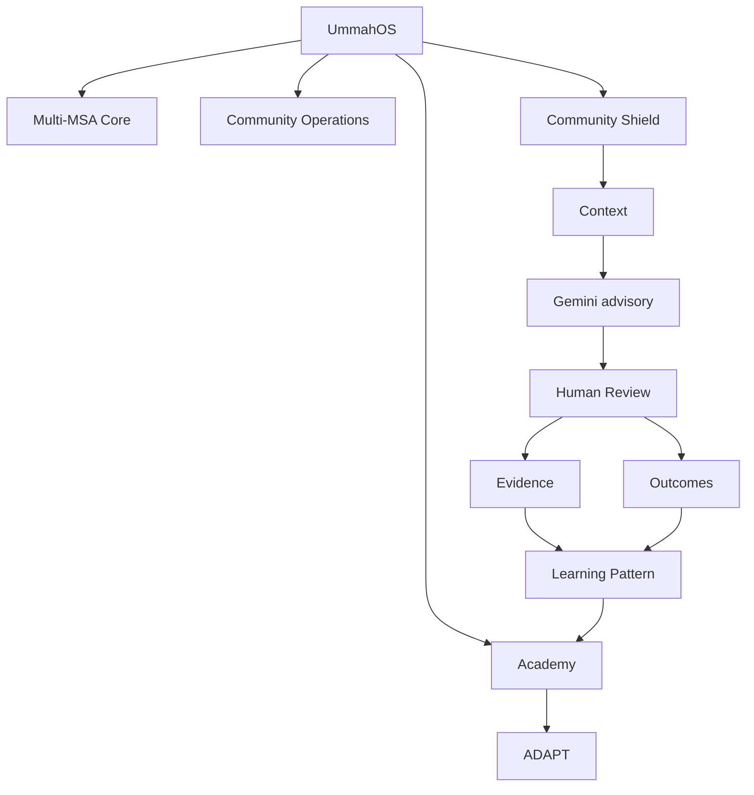

# UmmahOS Architecture

UmmahOS is a multi-organization community platform. Phases 1–11 are complete. This document describes the **implemented** architecture.

> AI assists. Humans decide.

## System overview

```text
UmmahOS
├── Multi-MSA Core (organizations, memberships, RBAC)
├── Community Operations (announcements, events, resources, members)
├── Community Shield
│   ├── Context (original item, replies, related items)
│   ├── AI (Gemini / fake provider — advisory)
│   ├── Human Review
│   ├── Evidence (JSON/PDF packages)
│   └── Outcomes (external reports, appeals, timeline)
└── Academy
    ├── Learning Patterns (from confirmed reviews)
    └── ADAPT (adaptive practice sessions)
```



Every community record is scoped to an `organization_id`. Frontend requests include the current organization. Backend policies and resources refuse cross-organization access. Switching organizations reloads context, permissions, and content.

Seeded demo organizations include Demo MSA Alpha, Beta, Gamma, and Delta. Alpha is the flagship complete story. Beta demonstrates isolation.

## Authentication

Laravel Sanctum issues tokens after login. The Vue app stores the session and loads organization context before authenticated routes render. Unauthenticated visits to protected routes go to `/welcome`.

## RBAC

Roles and permissions are **organization-scoped**. The same user can be a member in one MSA and an admin in another. Sidebar navigation is permission-aware (review queue, learning patterns, admin tools).

## Community Shield

Members submit structured incidents: platform, content type, visibility, original item, surrounding context, replies, related items, language, notes.

Reviewers open an incident review package: incident + context + optional AI analysis + human actions.

## AI provider abstraction

AI analysis is advisory. A provider interface supports an offline fake provider and Gemini when `GEMINI_API_KEY` is configured. Failures remain visible; they do not become verdicts. High uncertainty is surfaced for human attention.

## Evidence package service

Authorized reviewers can load a versioned evidence package and export JSON or PDF. Packages include incident, context, related evidence, AI analysis, uncertainty, human review, reporting route, and safety/privacy notes. Export is informational — not automatic submission to platforms.

## Outcome state machine

External reports record destination, status, decision, outcome, verification, and appeals. Status history powers the **What happened next?** timeline. Member views receive reporter-visible summaries only.

## Academy / ADAPT bridge

Confirmed reviews can produce a **Learning Pattern**. Community Safety lessons can start ADAPT sessions. ADAPT remains in `Adapt/` and is invoked through the UmmahOS backend; the frontend displays real session feedback (`noticed`, `why_this_question`, next challenge).

## Synthetic evaluation

`php artisan community-shield:evaluate` runs synthetic scenarios through context capture, advisory analysis, human-review routing, evidence, outcomes, and privacy canaries. See `docs/PHASE_10.md`.

## Frontend

Vue 3 SPA with a public landing page (`/` and `/welcome`) and an authenticated `AppShell` (sidebar, organization switcher, role-aware nav). Design tokens live in `frontend/src/styles/tokens.css`.

## What this is not

- Not a live integration with X, YouTube, or other platforms
- Not automatic content enforcement
- Not a claim of production scale or measured real-world efficacy
